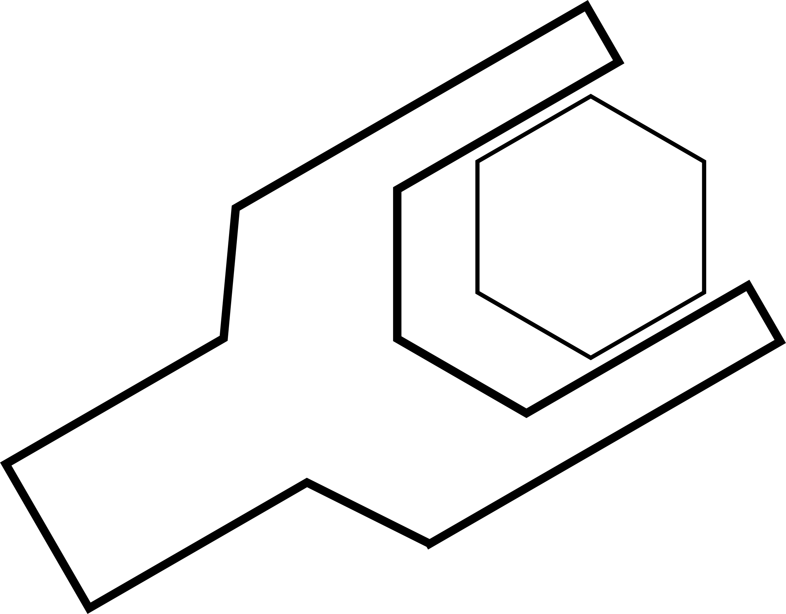

<h3>Orodja za razvoj aplikacij (vaje) 2023/2024</h3>  
  

## Dodatno gradivo za vaje pri predmetu Orodja za razvoj aplikacij

## Namestitev Pythona in IDE-ja

[Podrobna navodila za Windows](https://github.com/firefly-cpp/portali-in-sistemi-znanja/blob/main/podrobna-navodila/WINDOWS.md)  
[Podrobna navodila za Linux](https://github.com/firefly-cpp/portali-in-sistemi-znanja/blob/main/podrobna-navodila/LINUX.md)

## Literatura

[1] I. Fister ml., Š. Pečnik, S. Karakatič. Priročnik za računalniške vaje pri predmetu Orodja za razvoj aplikacij. Drugo učno gradivo. Maribor : Fakulteta za elektrotehniko, računalništvo in informatiko. Pridobljeno s: [https://dk.um.si/IzpisGradiva.php?lang=slv&id=78758](https://dk.um.si/IzpisGradiva.php?lang=slv&id=78758), 2021.

## Licenca

Shield: [![CC BY-SA 4.0][cc-by-sa-shield]][cc-by-sa]

Material in this folder is licensed under a
[Creative Commons Attribution-ShareAlike 4.0 International License][cc-by-sa].

[![CC BY-SA 4.0][cc-by-sa-image]][cc-by-sa]

[cc-by-sa]: http://creativecommons.org/licenses/by-sa/4.0/
[cc-by-sa-image]: https://licensebuttons.net/l/by-sa/4.0/88x31.png
[cc-by-sa-shield]: https://img.shields.io/badge/License-CC%20BY--SA%204.0-lightgrey.svg
